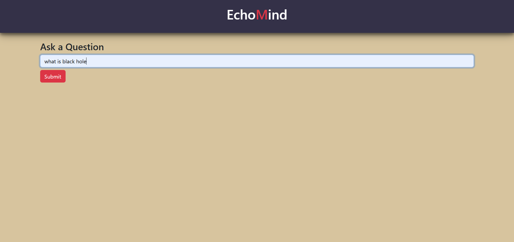
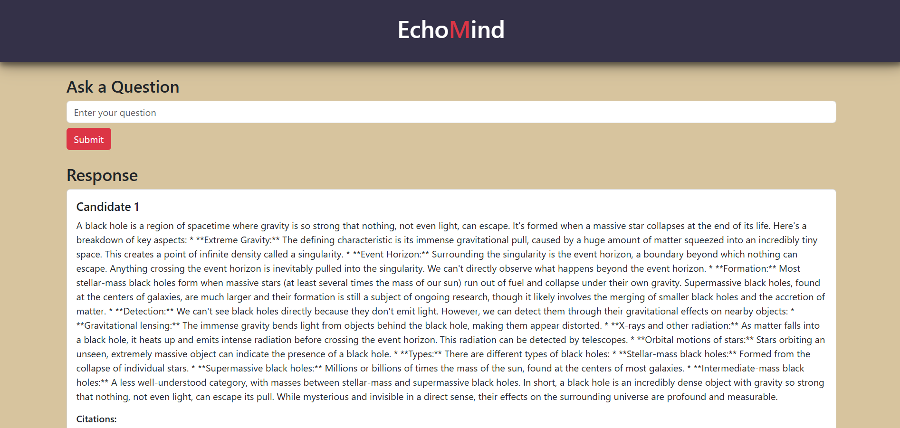

# EchoMind - Intelligent AI Response App




Welcome to **EchoMind**, an advanced AI-powered response system designed to facilitate intelligent and seamless conversations. EchoMind leverages cutting-edge artificial intelligence to provide real-time responses in a smooth, intuitive manner, offering users an engaging conversational experience.

## Table of Contents

- [Overview](#overview)
- [Features](#features)
- [Demo](#demo)
- [Tech Stack](#tech-stack)
- [Installation](#installation)
- [Usage](#usage)
- [API Endpoints](#api-endpoints)
- [Contributing](#contributing)

## Overview

**EchoMind** is an AI-driven platform built to simulate intelligent conversation. Designed for flexibility, it can be integrated with various applications requiring quick and contextually aware responses. Whether you need an AI chatbot, a customer service assistant, or an intelligent assistant for user interactions, EchoMind delivers efficient, dynamic responses in real-time.

## Features

- **Real-time AI Responses**: Get quick and meaningful replies that enhance conversational experience.
- **Context-Aware Interaction**: Maintains context during conversations for smooth and natural dialogue.
- **Easy Integration**: Compatible with various platforms via APIs.
- **Customizable Responses**: Fine-tune responses to align with specific requirements or tone of conversation.

## Demo

You can try out the BudgetBlaze live [here](https://echoomind.netlify.app/).


## Tech Stack

- JAVA17
- Spring Boot
- Spring Web
- Spring Data JPA
- Spring AI
- Spring MVC
- Lombok
- Docker
- React.Js
- Tailwind CSS
- Vite
- Maven

## Installation

Follow these steps to set up **EchoMind** locally:

1. Clone the repository:
    ```bash
    git clone https://github.com/omgupta7352/Echo-Mind.git
    cd /Echo-Mind
    ```

2. Set up the backend:
    - Install required dependencies:
        ```bash
        cd /EchoMind-main
        mvn install
        ```
    - Configure your AI API in `application.properties`.

    - Run the backend server:
        ```bash
        mvn spring-boot:run
        ```

3. Set up the frontend:
    - Navigate to the frontend directory:
        ```bash
        cd echo-mind-frontend
        npm install
        ```
    - Run the React development server:
        ```bash
        npm start
        ```

4. The app will be available at `http://localhost:5173`.

## Usage

Once the app is set up, you can begin interacting with EchoMind. Users can:

- Start a conversation by typing questions or commands.
- Receive real-time AI-generated responses.

### Example Commands:

- "What is the weather like today?"
- "Explain the theory of relativity."
- "Tell me a joke."

## API Endpoints

EchoMind provides several API endpoints for interaction:

- `POST /api/qna/ask`: Send user input and receive an AI-generated response.

## Contributing

We welcome contributions to enhance **EchoMind**! If you would like to contribute, please follow these steps:

1. Fork the repository.
2. Create a new branch:
    ```bash
    git checkout -b feature-branch
    ```
3. Make your changes.
4. Commit your changes:
    ```bash
    git commit -m "Add new feature"
    ```
5. Push to your forked repository:
    ```bash
    git push origin feature-branch
    ```
6. Create a pull request, and we will review it as soon as possible.


---

Enjoy seamless conversations with **EchoMind**! If you encounter any issues, feel free to raise them in the Issues section or contact us for support.
